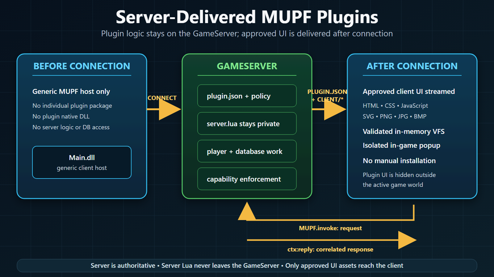

# MU Plugin Framework (MUPF)

## Server-delivered client UI with private GameServer logic

MUPF lets a server operator install client-facing features without rebuilding the game client for every plugin and without asking players to install plugin DLLs.

The game client contains the generic MUPF host only. Individual plugin UI files are stored on the GameServer and are delivered after the player connects. Important logic, permissions, player access, and database work stay in `server.lua` on the GameServer.

> **Scope:** this guide documents the packaged MUPF system under `Data/ClientLuaPlugin/`. It is separate from ordinary GameServer scripts and from the legacy `Data/LuaUI/` and WebUI delivery paths.

Each MUPF plugin has three parts:

- `plugin.json` — identity, compatibility, window geometry, launcher, hotkey, and requested capabilities;
- `server/server.lua` — private GameServer logic;
- `client/` — HTML, CSS, JavaScript, SVG, PNG, JPG, and BMP assets delivered to the client.



[Open the editable SVG version](assets/mupf-plugin-system-block-diagram.svg).

## Runtime lifecycle

1. The operator installs a plugin source folder under `Data/ClientLuaPlugin/`.
2. The GameServer reads `plugin.json` and intersects requested capabilities with `policy.json`. Capabilities are denied by default.
3. The GameServer loads `server.lua` into a per-plugin Lua environment. Server files are not included in the client payload.
4. When a player connects, the GameServer sends the plugin metadata followed by a chunked package containing `plugin.json` and `client/*`.
5. The client validates the API requirement and package limits, then unpacks the files into a per-plugin in-memory virtual file system.
6. The configured hotkey or launcher opens `client/index.html` in an in-game popup.
7. JavaScript calls `MUPF.invoke(functionName, data, callback)`.
8. The GameServer routes the request to that plugin's `OnInvoke(ctx, functionName, args, requestId)` handler.
9. `ctx:reply(requestId, table)` returns JSON to the original JavaScript callback, which can re-render the UI.

```text
Player click
    -> MUPF.invoke(functionName, JSON, callback)
    -> GameServer routes by plugin id
    -> server.lua: OnInvoke(ctx, functionName, args, requestId)
    -> validated server work / optional async SQL
    -> ctx:reply(requestId, table)
    -> original JavaScript callback
    -> MUPF.render(updatedHtml)
```

## What is currently supported

- Source-folder plugins with private `server.lua` and streamed client UI.
- Per-plugin manifest identity and API compatibility checks.
- Fixed main entry page: `client/index.html`.
- Optional fixed launcher entry page: `client/launcher.html`.
- Hotkey and launcher activation.
- Request/reply through `MUPF.invoke` and `ctx:reply`.
- Capability-gated basic player reads and asynchronous SQL.
- HTML/CSS rendering with JavaScript, SVG, PNG, JPG, and BMP assets.
- Per-plugin package, message, request, and rate limits.
- Server script reload through the GameServer's **Reload Script** command.

## Provisional features

The server can emit push and open protocol messages, but the current client host does not yet expose push events to plugin JavaScript or execute a server-initiated open. Treat `ctx:push`, `ctx:open`, and `host.open`/`host.openPlugin` as provisional. Use `MUPF.invoke` + `ctx:reply` and client-side `MUPF.open()` for production plugins.

The current command-line `MupfPacker` produces a client-only package (`plugin.json` + `client/*`). A server-backed plugin must therefore remain a source-folder deployment in the current release. See [MUPF Plugins](MUPF-Plugins.md#packaging-and-deployment) for the exact deployment contract.

## Security model

- Effective capabilities are `manifest permissions ∩ operator policy`.
- `server.lua`, database credentials, and server-only rules are never included in the client payload.
- Plugin requests are untrusted. `pluginId` selects a handler; it is not authorization.
- Database access is capability-gated and uses host-bound `?` parameters.
- Packages are unpacked into an in-memory VFS with path validation and anti-zip-bomb limits.
- No third-party native DLL is loaded for a plugin.
- `.mupf` obfuscation is a deterrent, not cryptographic secrecy. Keep secrets and trust decisions in `server.lua`.

## Development loop

For client UI changes:

```text
edit client/* -> reconnect/relog -> receive the refreshed client package
```

For server Lua, manifest, policy, or plugin-list changes:

```text
edit server files -> GameServer "Reload Script" (or restart)
```

Already connected players keep the client package they previously received. They must reconnect after client asset changes.

## Next steps

- [Writing Plugins](Writing-Plugins.md) — build a working plugin.
- [MUPF Plugins](MUPF-Plugins.md) — manifest, policy, limits, deployment, and packaging.
- [MUPF Server API](MUPF-Server-API.md) — private GameServer Lua API.
- [MUPF Client API](MUPF-Client-API.md) — in-game UI runtime.
